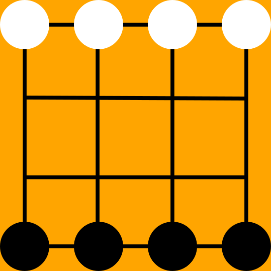

   

“两颗吃一颗”是民间流传的一种棋类游戏，由黑白双方各执四子在4×4格点棋盘上进行
对杀，各方的四颗子是等价的，不分兵种。它的吃子方式是“两颗吃一颗”，将对手杀
至一子的一方获胜。这个游戏是公平的，因为两个绝顶高手下这种棋，最终结果是平局。   

## 这个游戏的规则有很多变种
* 吃子的方法
 1. 两个打一个：`*@@`
 2. 两个夹一个：`@*@`
 3. 憋死：若有一颗棋子无法动弹，则这颗棋子就死了。  
由此又可衍生出两条规则：只能被敌人憋死才算；被任意棋子憋死都算。
* 游戏结束条件的判断有三种
 1. 杀光敌人算赢
 2. 把敌人打成一子算赢
 3. 无法给出合理的着法，也就是棋子全被憋住了，全部都无法动弹
因为一旦只剩下一子，就丧失了战斗力。但是这一子不一定就会死，所以有这两种规则。
* 棋子个数和棋盘的变化
有一种类似的游戏，它使用6颗棋子在4×4棋盘上，名字有很多：六子冲，六子棋，二打一棋。名字虽然不同，棋子个数虽略有差异，但同源同流。六子冲是6个棋子的两颗吃一颗。    
本程序游戏规则只有两条
* 两个打一个算吃子，憋死和夹死都不算吃子
* 把敌人打成一子算赢，把敌人棋子全被憋住无法动弹算赢

## 程序清单
* C++实现打表器，无敌版AI  
* C#实现界面，可以人机对战，机机对战
* C#调用产生的表，制成TableAI
* C#实现SearchAI，SearchAI是一个基于alpha-beta剪枝的搜索AI   
* Python实现一些代码片段用来估计状态个数。 
* Python使用Tkinter实现一个TableAI人机对战的界面程序  
* html5+ajax请求基于TableAI的JavaWeb后端，制成网页版两颗吃一颗

## 编程的一些原则
对于每一个棋局都是轮到黑子走，这样编程简单，可以统一处理黑子。 

###编码  
* 胜利1   黑子1  
* 失败2   白子2  
* 平局0   空白0  
空白应该为0，因为棋子种类可以增加，而空白永远特殊。 

### 哈希方法
* 对于6颗棋子，最大状态为1111100120022222(3)=42885004,有效状态9181132
* 对于4颗棋子，最大状态为1111000000002222(3)=42515320,有效状态276600 

## 打表器TableAI
* 众子皆胜我必败,破罐破摔可乱走  
* 一子为败我必胜，取此败子  
* 否则必为儿子中有胜有和，取和子才能不犯错

也就是说，为了最小化对手的利益，需要从儿子结点中优先选取败子，其次优先选取和子，最后不得已选择胜子。     

## 打表器输出table.txt的格式
table.txt为小头序的int数组，a[0],a[1],a[2]......
a[0]表示状态，a[1]表示a[0]状态的解法，把a[1]表示成3进制形式，则最末位表示该状态的胜负和三种状态。其余位表示棋盘上每个点是0（和）、1（胜利）或者2（失败）。

### 打表器构图法两种
* 法一：从开始状态进行广度优先搜索，直到搜索到某一方只有1子。  
* 法二：使用3进制法进行状态哈希，更好的方法是组合数哈希，但是那样编程复杂度高。那么棋盘从1变化到1111000000002222(3进制)，在构图过程中，跳过不合理的结点。  
组合数哈希：在两颗吃一颗中，有C(16,8)C(8,4)+C(16,7)C(4,3)+C(16,7)C(3,4)+...种状态。类似于全排列散列，给定一个1110001022000022这样的序列，可以将其映射为一个数字。使用组合数哈希能够节省空间。但是编程复杂度较大，并且可读性差。   

### 按照某个顺序给结点赋值
全部状态构成一张状态图，状态图之间的连接就是着法。  
对于整个状态图，是一个有向图（因为吃子之后无法逆回去）。  
构图的过程中已经把胜负确定了的局面加入到了队列中。构完图之后，就开始处理这个队列。对于队列中的每一个结点，更新它的父节点，告知众位父亲，我的状态是输还是赢（不可能为和，因为队列中不可能有和棋状态）。如果父节点发现自己有败子，则觉得自己必胜，父节点入队；如果父节点发现自己众子皆胜，则自己必败。如此处理队列，直到队列为空。  
那些未被处理的结点必然是和棋状态，它们的着法必然是从儿子中选取任意一个和棋状态，儿子中必然不存在败子（否则自己必胜），也必然存在和子（否则众子皆胜）。

### 打表器产生的数据
* 在丧失战斗力为输、两颗吃一颗规则下，从初始状态出发进行广搜可以达到（2188959 ）结点，这些结点中必胜结点有（1152375）个，必败结点有（653308）个，其余为和棋状态，有（383276）个。   
* 如果一个结点是必胜状态，它至多需要（42）步才能实现胜利。


## SearchAI：基于搜索实现的AI
### alpha-beta剪枝
* 讲个故事
一个父亲有两个儿子，大儿子有两个儿子，二儿子也有两个儿子。于是，父亲有四个孙子。
一天，大儿子看了一眼大孙子，说：“爹，您太伟大了，您伟大的功绩值100块钱！”父亲原来以为自己一生平庸一文不值，现在听到大儿子如此盛赞，不好意思的笑着说：“谬赞，谬赞！”过了片刻，大儿子又看了一眼二儿子，对父亲说：“确实有点谬赞，您的功绩也就值50块钱。”父亲听了心里不是滋味，想打大儿子一巴掌，结果想想自己“值100”这句话也是从大儿子嘴里冒出来的，也就罢休了。毕竟，一开始父亲以为自己一文不值，现在相信大儿子能让自己值50块钱，所以父亲也就相信大儿子了。现在，父亲承认了自己值50块钱。过了几天，二儿子看了一眼自己的大儿子，对父亲说：“爹，根据您的三孙子的长相能为，您也就值20块钱。”父亲听了勃然大怒，狠狠打了二儿子一巴掌，骂道：“他妈的，你大哥都说了，老子至少值50，老子宁愿相信你大哥也不能相信你！”二儿子吓傻了，本来还想根据自己的二儿子评估一下父亲，结果现在吓得浑身哆嗦，默默地使眼色给二儿子叫他躲远点，不用见爷爷了。  

* alpha-beta剪枝对每个结点维护一个可取值窗口。如果子孙结点的取值超出了这个窗口，子孙结点就会被剪枝。
* alpha-beta剪枝不一定全部实现，也可以写成alpha剪枝或者beta剪枝，那样效率会低一些。

beta剪枝的过程如下，fatherValue就是beta值，是父节点取值的下界，如果子孙结点的取值比这个下界还要小，就要对此节点进行剪枝。
```python
def go(state,fatherValue,depth):
	if depth==MAX_DEPTH:
		myValue=调用评估器评估state
		return myValue
	minSonValue=MAX_VALUE
	for sonState in getSons(state):
		sonValue=go(sonState,-minSonValue,depth+1)
		if sonValue<minSonValue:
			minSonValue=sonValue
		if minSonValue<=fatherValue:
			return MAX_VALUE
	return -minSonValue
```

alpha-beta剪枝有两种写法，方法一比较直观但略微繁琐，方法二写法简洁但不够直观。

方法一：
```
Function alpha_beta(node, depth, alpha, beta, player)
	If depth = 0 then
		return evaluate(node)
	if play = ‖black‖ then
		for each child of node do
			alpha = max(alpha, alpha_beta(child, depth-1, alpha, beta, ―White‖)
			if alpha >= beta then break
				return alpha
			else do
			for each child of node do
				beta = min(beta, alpha_beta(child, depth-1, alpha, beta, ―Black‖)
				if beta <= alpha then break
				return beta
/*开始执行*/
alpha_beta(root, depth, −∞, +∞, ―Black‖)
```
方法二：
```cpp
int AlphaBeta(int depth, int alpha, int beta) {
　if (depth == 0) {
　　return Evaluate();
　}
　GenerateLegalMoves();
　while (MovesLeft()) {
　　MakeNextMove();
　　val = -AlphaBeta(depth - 1, -beta, -alpha);
　　UnmakeMove();
　　if (val >= beta) {
　　　return beta;
　　}
　　if (val > alpha) {
　　　alpha = val;
　　}
　}
　return alpha;
}
```

### 局面评估
* 局面评估使用最简单的黑棋个数减去白棋个数表明当前棋局的估值。  
* 如果为必胜态，则估值为极大值（不是黑白之差）。 
* 如果为必败态，则估值为极小值（不是黑白之差）。 

### alpha-beta剪枝优化
要让父节点的值以最快的速度下降，这样能够增大剪枝力度。做法是优先深度优先搜索那些看上去比较好的着法而不是按照固定的顺序进行搜索。  
也就是说，生成全部的着法，对着法列表进行排序，优先搜索扩展那些比较好的局面。

### 一个问题
使用暴力搜索，至少看（）步才能保证自己立于不败之地。  
也就是说至少展开几层才能保证自己不败。  

#### 什么叫做立于不败之地？  
就是如果这个棋局不是必败局面，我给出的着法（也就是下一状态）就一定不会让神一样的对手看出破绽，我一定不会因为我的失误而失败。如果是必败局面，我完全不在乎，可以瞎走。而如果棋局是必胜局面，我不一定能看出来必胜。我是一个不求胜只求不败、不求有功但求无过的人。  
定义：立于不败之地
* 必胜局：我不输
* 和局：我不输
* 败局：我随意

立于不败之地的几种错误理解：   
对于任意给定的棋局，TableAI给这个棋局贴上“胜败和”三种标签，SearchAI也给这个棋局贴上一个标签，如果这两个标签不同，那么SearchAI没立在不败之地。
反例：SearchAI可能无法给一个胜局贴上必胜标签（因为搜索较浅，它无法捉住对手的破绽打败对手），但是SearchAI照样能够在这种错误认识下走出一招正确的着法。走了若干步之后，它可能恍然大悟自己必胜。 
也就是说：考量状态标签只是评价一个AI的观点，并不能代表这个AI的行动。
而另一方面，很多AI的着法有多种，AI返回的只是从可行着法中随机选取一种着法，所以无法考量一个AI针对某个局面的全部着法。也就是说，考量“观点”是错误的，考量“行动”是不可行的，难以枚举的。但是，对于本SearchAI每次返回的着法都是一个固定的列表，中间不存在随机因素。所以可以采用考量着法的方式判断AI是否达到无敌水平。  
错误理解二：对于给定的棋局，如果它是非必败局，那么SearchAI认为这局非必败。  
反例：当搜索深度非常浅的时候，SearchAI总是盲目乐观地认为自己非必败，因为它目光短浅，看不到自己黑暗的未来。  
正确理解：对于给定的棋局，如果它是非必败局（TableAI的观点），那么SearchAI给出的任意着法必定不会导致SearchAI走向失败，也就是说下一状态一定不会是对手的必胜状态（TableAI评估下一状态的观点）。

对于任何贪心规则，只要搜索足够深，必然有解。只是贪心规则有好有坏，好的贪心规则能够使搜索深度小，坏的贪心规则有跟没有区别不大。 
保证自己子力不落后，这就是一个贪心规则，这个规则能够使得搜索深度减小。 

### SearchAI把和棋当做必胜的情况
SearchAI有4子，敌人有3子时。本来是和棋状态，4子无法打败3子。SearchAI觉得最终和棋状态自己子多，所以觉得自己算赢，而实际上，不能算赢。  
方案一：返回0，和棋。这种方法在SearchAI搜索深度较小的情况下会走出大量昏招，因为它把许多必败状态当成了和棋。这样做肯定是不可以的，它会影响搜索的质量（包括剪枝可能会减少，着法可能会变差）。这种方法影响了局面的评估，相当于完全放弃了局面评估。  
方案二：返回黑白棋子之差。只能这么处理，这就需要在结果中判断一下输赢。如果子力差没变，这就说明和棋。  
当考察SearchAI对当前局面的观点时：如果局面估值为极大值，则必胜；若为极小值，则必败；否则，和棋。就算黑棋比白棋多一子，也依然是和棋。

### 如果minSonValue==fatherValue，这时应不应该进行剪枝呢？  
如果说剪枝，那是对的，因为当前节点肯定无法给出更好的答案，直接让这个节点返回MAX_VALUE才叫剪枝，不能返回-minSonValue，那样会让父节点以为这个儿子是最优秀的儿子之一，而实际上，这个节点是被剪枝了的结点，它完全有可能给出更差的解，也就是它会产生比minSonVlaue更小的解。 
如果说不剪枝，那也是对的，因为当前节点如果不剪枝，它的minSonValue有可能最终也还是fatherValue，那么这个节点必然应该作为父节点的最优儿子对待，而不应该剪掉。 
正确观点：如果不剪枝目的是增多可选解，而实际上可选解只在depth=0的情况下有意义，其它情况下根本不需要有很多可选解，所以在depth=1的情况下，即便minSonValue等于fatherValue也不能剪枝。在depth>0的情况下，只要是`minSonValue<=fatherValue`就要进行剪枝。  

### SearchAI明明必胜，却走起了重复棋
这是因为使用了一个列表存储搜索过的状态，A态为必胜态，B态也为必胜态，当搜索过A之后，A的估值变成必胜，当B进行搜索时，就必然选择了必胜态A。这样这两个状态确实都是必胜态，但是它俩就在这里来回走，似乎必胜态是一个循环。  
这个道理多么深刻呀！状态A是必胜态，状态B也是必胜态，他们互为决策。于是形成死循环，它俩从此都沦为重复态，必胜态成了一句空话，一个虚构的理想，一个可望而不可即的梦，而它俩却满怀憧憬，自以为自己是必胜态，殊不知当他俩互相依赖为必胜态的那一瞬间，它俩已经都不再是必胜态了。  
解决方法：将解与所需步数联系起来，当有多个可行解时，优先返回到达胜利需要最少步数的那个解。也就是说，评估一个结点的好坏，应该考虑这个结点到达游戏结束的距离。

## 好玩
用SearchAI和TableAI分别判断一个棋局的好坏，可以找出SearchAI的局限之处，同时也能找到比较有难度的棋局。通过调大搜索深度，可以使SearchAI表现得更好一点。
```
2211
1200
0000
0000
至少搜索13层才能保证SearchAI能够看出黑子必胜来。
1212
1200
0000
0000
=========== 637 这局本是白子必胜，SearchAI却认为是和棋,必须搜索18步才能看出来白子必胜
2221
1120
0000
0000
=========== 1835 mine=0 ans=2
1212
1120
0000
0000
=========== 1852 mine=0 ans=2       这是白棋以少胜多的战例
0121
1200
0000
0000
=========== 615 mine=1 ans=1 result0 这个游戏23层才能必胜
1020
1201
0000
0000
=========== 2773 mine=0 ans=1   这个游戏27层才能看到必胜
2211
2121
0000
0000
=========== 4094 mine=1 ans=0 这个游戏为和棋，但是SearchAI却认为自己子多能赢
2201
1211
2000
0000
=========== 16640 mine=0 ans=1 非常深，大于27
2010
2202
1110
0000
=========== 90326 mine=0 ans=1 非常深 ，大于27
```
使用TableAI打表查找最大步数
```
===========
 * - @ @
 * * @ -
 - - - -
 - - - -
need 18 steps to win
===========
 - @ * @
 * @ - *
 - - - -
 - - - -
need 26 steps to win
===========
 - * @ *
 - @ @ @
 * * - -
 - - - -
need 30 steps to win
===========
 - - - @
 @ - * @
 @ * * -
 - - - -
need 32 steps to win
===========
 - - @ *
 - - @ -
 * @ * *
 - - - -
need 34 steps to win
===========
 - @ * @
 * * * -
 @ - - @
 - - - -
need 35 steps to win
===========
 - - - @
 * - @ @
 * * @ -
 * - - -
need 36 steps to win
===========
 - * @ -
 @ * @ -
 * * - -
 @ - - -
need 38 steps to win
===========
 * - - @
 @ * @ -
 * * - -
 @ - - -
need 40 steps to win
===========
 - - - @
 * - @ -
 * - * *
 @ @ - -
need 42 steps to win 令人叹为观止的42步神一样的棋，明明感觉双方势均力敌
结果黑棋巧妙穿插竟然赢了,而如果用SearchAI需要思考两分钟才能想出好招来，而这两分钟大部分时间都在建表。远远多于打表器建表的方式。
```
一种错误观点：
>虽然需要42步才能看出一盘棋是赢是输，但是对于SearchAI完全不需要看出一盘棋是谁赢，它只需要贪心的走出一步来就可以。贪心足以保证自己不会因为自己的失误而丧命。

但是，如果SearchAI看不出一个局面是必胜局面，那么SearchAI必然看不出一个局面是必败局面，那么它就会把这个局面当做和棋局面来作为可行解之一，从而导致有可能走出昏招。所以，SearchAI还是需要分辨出局面的胜负的。所以，必须搜索42步。
