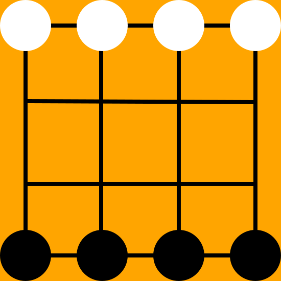

   

“两颗吃一颗”是民间流传的一种棋类游戏，由黑白双方各执四子在4×4格点棋盘上进行
对杀，各方的四颗子是等价的，不分兵种。它的吃子方式是“两颗吃一颗”，在某一行上或者某一列上，只要出现形成了，将对手杀
至一子的一方获胜。这个游戏是公平的，因为两个绝顶高手下这种棋，最终结果是平局。   

# 程序清单
* C++实现打表器，无敌版AI  
* C#实现界面，可以人机对战，机机对战
* C#调用产生的表，制成TableAI
* C#实现SearchAI，SearchAI是一个基于alpha-beta剪枝的搜索AI   
* Python实现一些代码片段用来估计状态个数。 
* Python使用Tkinter实现一个TableAI人机对战的界面程序  
* html5网页版两颗吃一颗
